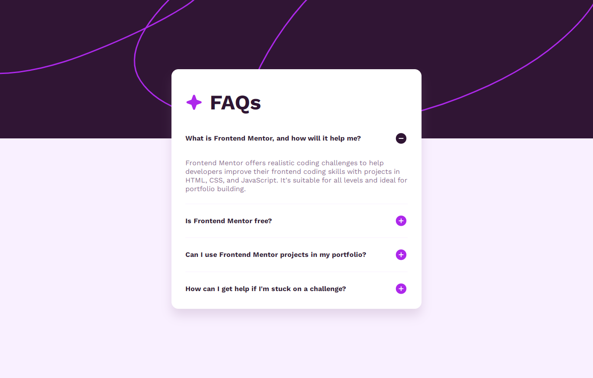
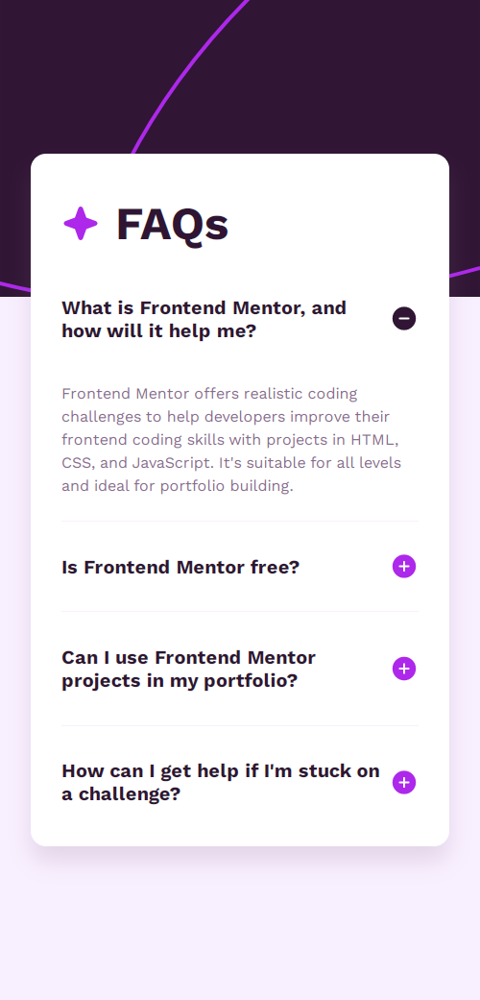

# Frontend Mentor - FAQ accordion solution

This is a solution to the [FAQ accordion challenge on Frontend Mentor](https://www.frontendmentor.io/challenges/faq-accordion-wyfFdeBwBz).

## Table of contents

- [Overview](#overview)
  - [Screenshot](#screenshot)
  - [Links](#links)
- [My process](#my-process)
  - [Built with](#built-with)
  - [What I learned](#what-i-learned)
  - [Useful resources](#useful-resources)
- [Author](#author)

## Overview

### The challenge

Users should be able to:

- Hide/Show the answer to a question when the question is clicked
- Navigate the questions and hide/show answers using keyboard navigation alone
- View the optimal layout for the interface depending on their device's screen size
- See hover and focus states for all interactive elements on the page

### Screenshot




### Links

- Solution URL: [Github repo](https://github.com/b16h22/faq_accordion_solution)
- Live Site URL: [Github pages](https://github.com/b16h22/faq_accordion_solution/actions)

## My process

### Built with

- Semantic HTML5 markup
- CSS custom properties
- Flexbox
- Mobile-first workflow

### What I learned
Setting an onclick event listener to the list items and executing the open/close function for FAQ answers.

```js
for(let x of faqListItem) {
  x.onclick = openFaq;
}

function openFaq(event) {
  const childFaqText = event.currentTarget.querySelector(".faq-expanded-text");
  const childButton = event.currentTarget.querySelector(".plus-button");
  if (childFaqText.style.display === "none") {
    childFaqText.style.display = "inline-block";
    childButton.src = "./assets/images/icon-minus.svg";
  } else {
    childFaqText.style.display = "none";
    childButton.src = "./assets/images/icon-plus.svg";
  }
}
```
### Useful resources

- [HTML DOM Elements](https://www.w3schools.com/js/js_htmldom_elements.asp) - This helped me learn about HTML DOM elements and methods to access them.
- [JS For of loop](https://www.w3schools.com/js/js_loop_forof.asp) - This helped me understand the 'for of' loop for looping through the values of an iterable object.
- [JS If else](https://www.w3schools.com/js/js_if_else.asp) - This helped me learn about If else conditional statement.

## Author

- Frontend Mentor - [@b16h22](https://www.frontendmentor.io/profile/b16h22)